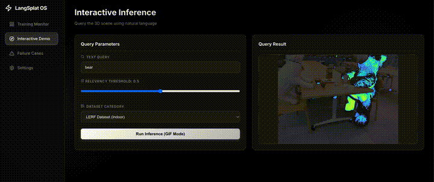
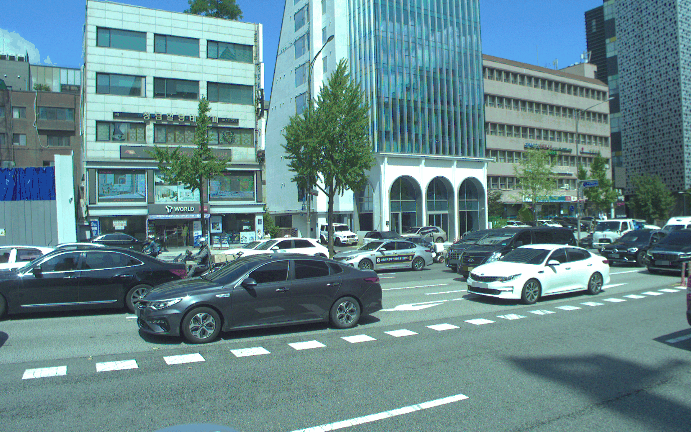

# LangSplat OS

This repository contains the LangSplat project, an enhanced framework for 3D Gaussian Splatting with semantic scene understanding capabilities.

## Features

- **Training Monitor Platform**: Built-in `TrainingMonitor` for real-time tracking of GPU usage, Gaussian point counts, iteration speeds, and refined loss metrics.
- **Data Strategy**: Advanced preprocessing tools including cropping, smooth transitions, and custom image integration.
- **Frontend Interface**: An intuitive interface for running models, visualizing training state, and interacting with semantic queries.

## Structure

- `frontend/` - React-based user interface for monitoring and interacting with the system.
- `backend/` - Server-side scripts supporting the platform.
- `LangSplat/` - Core LangSplat framework codebase.
- `lerf_ovs/` - Integration of Language Embedded Radiance Fields.

## Visualization Results

Here are some examples of the semantic scene understanding capabilities in action:

**Platform Running Example:**


*(High-quality video available [here](images/running_example.mov))*

**Original 3D Gaussian Splatting Reconstruction:**


**Semantic Object Detection (e.g., 'Car'):**


## How to Run

### 1. Start the Platform
You can start both the frontend interface and the backend server simultaneously using the provided script:
```bash
./start_platform.sh
```
- The **Frontend Dashboard** will be accessible at: `http://localhost:5173`
- The **Backend API Docs** will be available at: `http://localhost:8000/docs`

To stop the servers, simply press `Ctrl+C` in your terminal.

### 2. Preprocessing Data
If you need to preprocess custom images, you can use the available Python scripts:
```bash
python preprocess_crops.py
# For smooth transition preprocessing:
python preprocess_crops_smooth.py
```
